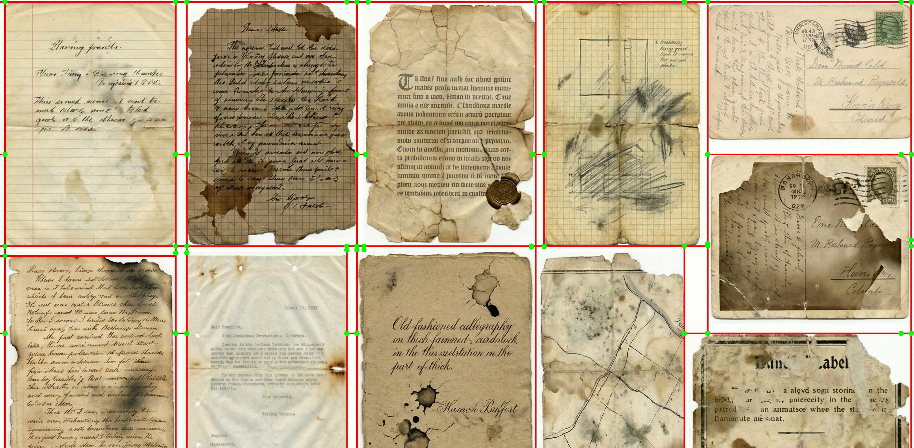

# Scratch CV Document Segmentation

A Python project that implements document segmentation algorithms from scratch using primarily **NumPy**. This project demonstrates the inner workings of classic Computer Vision techniques without relying on high-level OpenCV functions for the core logic.

## Features

- **Pure NumPy Implementations**: Core algorithms are built from scratch to understand the math behind them.
  - **Hough Transform**: Custom accumulator and voting logic to detect lines.
  - **Edge Detection**: Custom Sobel operators and Non-Maximum Suppression (NMS).
  - **Gaussian Blur**: Sliding window convolution implementation.
  - **Morphological Operations**: Custom grayscale closing (dilation followed by erosion).
- **Geometric Post-Processing**:
  - Line filtering and clustering.
  - Intersection calculation to find document corners.
  - Logic to clip lines to image boundaries.
- **Visualization**: Custom drawing functions to annotate images with detected lines and corners.

## Usage

### Prerequisites
Make sure you have the required Python packages installed:

```bash
pip install -r requirements.txt
```

*(Main dependencies: `numpy`, `pandas`, `opencv-python`)*

### Running the Project

1. **Prepare Data**: Place your input images (documents on a background) in the `data/` directory.
2. **Run the Script**:
   ```bash
   python image_segmenter.py
3. **View Results**:
   - **Annotated Images**: Check the `annotated_images/` folder to see the detected document boundaries and corners overlayed on the original images.
   - **Data**: Segment coordinates are saved to `lines_data.csv`.

## Project Structure

- `image_segmenter.py`: Main entry point. Handles the image processing pipeline (Blur -> Edge Detection -> Hough Transform -> Post-processing).
- `hough_transform.py`: Contains the custom implementation of the Hough Line Transform and weighted voting mechanisms.
- `data/`: Directory for input images.
- `annotated_images/`: Directory where processed results are saved.

## key Results

Here is an example of the segmentation process:

### Input
Input Image 2


Input Image 3


### Output

Output Image 2


Output Image 3
